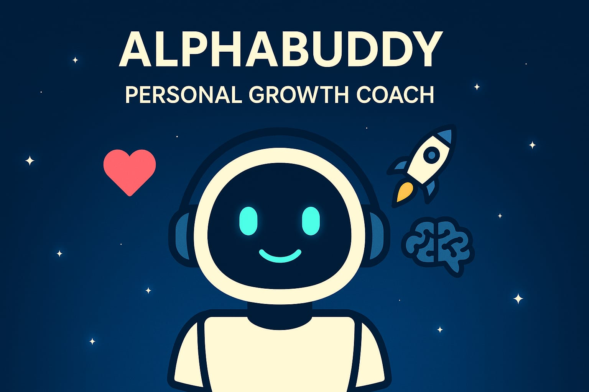

# AlphaBuddy🧠 – AI Chatbot for Motivation, Focus, and Growth

   

AlphaBuddy is a smart, friendly AI-powered chatbot built during my Prompt Engineering Internship at **Future Interns**. It's designed to help users stay focused, feel motivated, build confidence, and reset emotionally — all through calm, human-like conversation.

### 🧠 AlphaBuddy's 3 Core Persona Roles

| Role                  | Purpose                              | Example Behavior |
|-----------------------|--------------------------------------|------------------|
| 💬 Motivational Coach | Supports emotions, mindset & growth | Shares quotes, builds confidence, responds empathetically |
| 🧑‍💻 Productivity Partner | Helps with focus, daily goals      | Pomodoro timers, 3-goal routine, no-distraction reminders |
| 📘 Knowledge Buddy    | Teaches academic or technical topics | Explains clearly like a tutor, simplifies concepts |

### 🌟 Features
- 🚀 Motivational quotes & mental reset guidance
- 🎯 Daily goal setting and productivity support
- 💬 ChatGPT-like responses with natural tone
- 🤝 Calm, friendly, and emotionally aware personality
- 📚 Educational help (can explain concepts in simple terms)

### 🔗 Live Chatbot Link
👉 [Try AlphaBuddy Now](https://landbot.online/v3/H-3039699-7SRS68U7JTUYNRLS/index.html)

### 💡 Technologies Used
- Landbot (GPT Agent + Flow)
- Prompt Engineering
- Chat UX Design
- No-code tools

### 📂 Files in this Repo
| File | Description |
|------|-------------|
| `chatbot_prompt.txt` | Full prompt uploaded in Landbot AI Agent |
| `assets/` | UI screenshots, thumbnails, QR Code |
| `chatbot_persona.json` | (Optional) Bot config backup |
| `README.md` | Overview of project |

### 📚 What I Learned
- Designing chatbot personas and      tone
- Writing effective AI prompts
- Using no-code tools like Landbot
- Creating user-friendly chat flows
- Embedding chatbot in website 
---

> 💬 _"Sometimes you don’t need a therapist or a teacher—just a buddy who listens and helps. That’s AlphaBuddy."_  
>  
> Made by Aniket Singh ❤️  AI + Creativity

---
